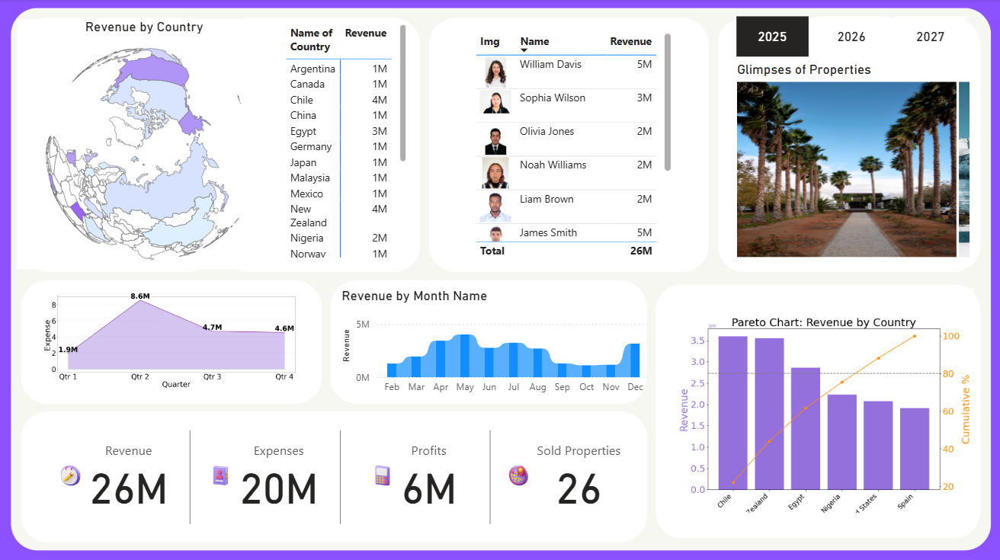

# 🏠 Global Real Estate Sales & Analytics Dashboard

## 📌 Project Overview
This project is an interactive **Power BI Real Estate Analytics Dashboard** designed to analyze property sales, revenue, profitability, customer transactions, and property availability across multiple countries.

The dashboard provides real-time business insights using dynamic visualizations, KPIs, filters, and advanced analytics to support data-driven decision-making in the real estate domain.

---

## 📊 Dashboard Highlights

- 💰 Total Revenue Analysis
- 📉 Expense & Profit Tracking
- 🏡 Sold vs Vacant Property Monitoring
- 🌍 Country-wise Revenue Insights
- 👥 Client Purchase Analysis
- 📆 Monthly & Quarterly Revenue Trends
- 📈 Pareto Chart Analysis
- 🖼️ Property & Client Image Integration
- 🎛️ Interactive Filters & Slicers

---

## 📌 Key Metrics

| Metric | Value |
|---|---|
| Total Revenue | 26M |
| Total Expenses | 20M |
| Total Profit | 6M |
| Sold Properties | 26 |

---

## 🛠️ Tools & Technologies

- Power BI
- Power Query
- DAX
- Data Modeling
- Data Visualization
- Excel / CSV Dataset

---

## 📂 Dataset Information

The project includes:
- Property Details Dataset
- Client Information Dataset
- Sales Transaction Data
- Date Table
- Property Images

---

## 📈 Features Implemented

- Data Cleaning & Transformation
- Relationship Modeling
- KPI Cards
- Drill-through Analysis
- Dynamic Filtering
- Time Intelligence Calculations
- Interactive Dashboard Design

---

## 🎯 Business Objective

The main objective of this project is to help stakeholders:
- Monitor real estate sales performance
- Identify profitable markets
- Track property availability
- Analyze customer buying patterns
- Improve business decision-making

---

## 📷 Dashboard Preview

---

## 🚀 Project Outcome

Successfully developed a centralized analytics dashboard that improves reporting efficiency and provides actionable insights into global real estate business performance.

